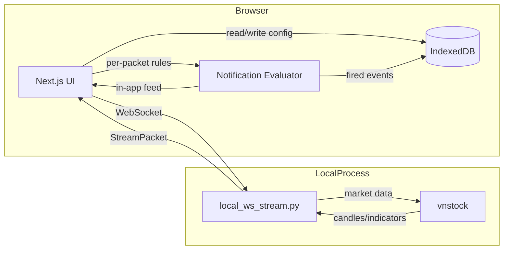

# Candlestick Product Blueprint

## 1. Product Goal

Build a browser-only market analytics web application where users can:

- Manage multiple dashboards.
- Assign one active indicator per dashboard.
- Track symbol-level indicator outputs in a table and detail chart.
- Receive realtime updates after initial hydration.
- Configure notifications tied to symbol plus indicator conditions.

The architecture is hydrate-then-stream with no cloud backend: a local Python WebSocket stream (`frontend/scripts/local_ws_stream.py`) backed by `vnstock` feeds the Next.js UI, and all user data is persisted in the browser via IndexedDB.

## 2. Scope Summary

### 2.1 In Scope (v1)

- Multi-dashboard support with selector, add, and edit flows.
- Indicator management screen with:
  - Prebuilt indicator catalog.
  - User-created indicators.
  - Parameter tuning for indicator configuration.
- One-indicator-per-dashboard rule.
- Dashboard layout with two main sections:
  - Stocks table list.
  - Symbol detail chart with indicator overlays.
- Initial market data hydration on first load.
- Realtime refresh using a local WebSocket stream.
- Browser push notifications (optional) and in-app alerts for user-defined conditions.
- Persistence of user configuration and notification history in browser IndexedDB (no server, no cloud account).

### 2.2 Out Of Scope (v1)

- Free-form custom formula code editor for indicators.
- Multi-indicator overlay per single dashboard.

## 3. Core Product Capabilities

### 3.1 Dashboard Management

Users can create, select, edit, and archive dashboards.

Rules:

- A dashboard belongs to one user.
- A dashboard has exactly one active indicator assignment at a time.
- A dashboard owns its symbol watchlist.
- Dashboard metadata includes at minimum:
  - dashboard_id
  - dashboard_name
  - indicator_id
  - optional description
  - created_at and updated_at

### 3.2 Indicator Management

Users can open an indicator management screen and:

- Browse prebuilt indicators.
- Duplicate prebuilt indicators into user-owned variants.
- Create custom indicators from supported templates.
- Tune parameters within validated ranges.
- Save a versioned indicator configuration.

Rules:

- Indicator execution contract remains stable: {"metric": float, "signal": str}.
- Parameter tuning must be schema-validated before save and before assignment to a dashboard.
- Editing an indicator currently assigned to dashboards must preserve backward compatibility through versioning or safe migration.

### 3.3 Dashboard Data Surface

Each dashboard renders two synchronized sections.

Section 1: Stocks Table List

- Purpose: quick-glance analysis for all symbols in the current dashboard watchlist.
- User actions:
  - Add supported symbols.
  - Remove symbols.
  - Select a symbol to focus detail chart.
- Minimum displayed columns:
  - Symbol
  - Company Name
  - Price
  - Indicator Metric(s)
  - Indicator Signal

Section 2: Symbol Detail Chart

- Purpose: deep view for the selected symbol in current dashboard.
- Header content for chart panel:
  - Symbol code and full company name.
  - Timerange selector (minimum: 1D, 1W, 1M; extensible).
- Chart content:
  - Price history series for selected timerange.
  - Indicator overlays and markers relevant to active indicator.

### 3.4 Header Layout Contract

The top header of the dashboard page must contain:

- Dashboard selector.
- Active indicator badge showing:
  - indicator display name
  - short description
- Dashboard action controls:
  - Add dashboard
  - Edit dashboard

The header must be responsive and remain usable on mobile widths.

## 4. UX And Screen Contracts

### 4.1 Main Dashboard Screen

Layout intent:

- Top: unified header controls and active context.
- Body: two-column desktop layout (table left, detail chart right).
- Mobile: stacked sections with preserved workflows and minimal interaction loss.

Behavior:

- Selecting a row or symbol chip updates detail chart context.
- Changing dashboard updates table, chart, and active indicator context together.
- Changing timerange only affects detail chart history window, not watchlist membership.

### 4.2 Indicator Management Screen

Minimum modules:

- Indicator catalog list (prebuilt plus user-owned).
- Indicator detail pane with:
  - name
  - short description
  - parameter form
  - validation feedback
- Save, duplicate, and assign actions.

### 4.3 Dashboard Configuration Screen

Minimum modules:

- Dashboard name and description editor.
- Indicator selector (exactly one indicator assigned).
- Symbol watchlist manager.
- Save and cancel flows with validation.

## 5. Data And Persistence Model

### 5.1 Storage Principles

- Persist all user data in the browser via IndexedDB (no server, no cloud account).
- Keep one object store per entity type: `dashboards`, `indicators`, `notificationRules`, `notificationEvents`, `pushSubscriptions`.
- Maintain a stable local user id (UUID in `localStorage`) to scope client state.

### 5.2 Core Entity Types

- Local User (stable id in localStorage)
- Dashboard
- Dashboard Symbol Mapping (embedded in dashboard)
- Indicator Definition
- Notification Rule
- Notification Event (history)
- Push Subscription (optional, stored but delivery requires a push server)

### 5.3 Required Relationships

- One local user -> many dashboards.
- One dashboard -> one active indicator.
- One dashboard -> many symbols.
- One local user -> many indicators (custom or duplicated variants).
- One local user -> many notification rules.
- One notification rule -> many notification events (history in IndexedDB).

### 5.4 Realtime Connection

The browser opens a WebSocket directly to the local stream (`ws://localhost:8788`). There are no server-side connection records; the stream is a single long-lived Python process.

Rules:

- The UI reconnects automatically with a connection-state model (connecting, connected, reconnecting).
- Dashboard scoping is enforced client-side by ignoring packets whose `dashboard_id` differs from the selected dashboard.

## 6. Realtime Data Contract

### 6.1 Hydrate Then Stream Lifecycle

On first dashboard load:

- Read dashboards, indicators, and notification rules from IndexedDB.
- Connect to the local WebSocket stream and render the initial selected-symbol chart from the first validated packet.
- Render table and chart from hydrated client state.

After hydration:

- Subscribe to realtime updates over the local WebSocket.
- Apply validated packets to state.
- Keep updates scoped to the active dashboard context (ignore other `dashboard_id` values).

### 6.2 Stream Packet Requirements

Packets must include:

- dashboard_id
- connection_id
- optional as_of_epoch
- data map keyed by symbol with indicator outputs

Client rules:

- Validate payload shape before applying updates.
- Ignore packets for other dashboards.
- Preserve stable indicator signal vocabulary across the local stream and frontend.
- Notification rules are evaluated client-side (see `src/lib/client/notifications.ts`); the stream does not push `notifications`.

## 7. Notification System Requirements

### 7.1 Notification Rule Model

Users can configure alert rules with at least:

- target dashboard
- target symbol
- target indicator
- condition operator and threshold or signal condition
- cooldown or suppression window
- enabled or disabled state

### 7.2 Delivery Channels

v1 supports:

- In-app alert notifications while dashboard is open (always available).
- Optional browser push notifications (service worker based); push subscriptions are stored in IndexedDB but delivery requires a push server, which is out of scope for the local-only setup.

Behavior:

- Request browser permission explicitly (only when push is enabled).
- Do not send duplicate notifications during cooldown (enforced client-side via `lastTriggeredAtEpoch`).
- Persist notification rules and fired events in IndexedDB.

## 8. Auth And Security Baseline

Authentication model for this blueprint:

- No server-side auth. A stable local user id (UUID) is generated and stored in `localStorage` (see `src/lib/client/user.ts`).
- All data is scoped to the browser that created it; there is no cross-device or multi-user sharing.

Requirements:

- Every mutable entity operation is user-scoped to the local browser.
- Dashboard, indicator, and notification access are isolated per browser profile.
- No session expiry or revocation is needed because there is no server session.

## 9. Non-Functional Requirements

- Fully browser-local: no always-on server, no cloud account, no external network calls except the optional `vnstock` market data fetch from the local stream.
- Mobile-safe and desktop-safe responsiveness for table and chart areas.
- Observability via in-app notification feed and browser DevTools (IndexedDB, console).
- Backward-compatible contracts for indicator result shape and websocket payload fields.
- Simple local run: `npm run dev:local` starts both the Next.js app and the Python stream.

## 10. Implementation Notes

- Keep frontend type definitions as source of truth for stream payload contracts.
- Keep indicator output contract unchanged for compatibility.
- Preserve dashboard-scoped routing client-side by ignoring packets for other dashboards.
- Prefer parameterized environment controls for runtime tuning over hard-coded constants (see `frontend/scripts/local_ws_stream.py`).
- Notification evaluation lives entirely in the browser (`src/lib/client/notifications.ts` + `src/hooks/useNotificationEvaluator.ts`).

## 11. Acceptance Criteria Checklist

A release candidate satisfies this blueprint only if:

- Header shows dashboard selector, active indicator name plus short description, and add/edit dashboard actions.
- User can create and manage multiple dashboards.
- Each dashboard enforces exactly one active indicator.
- User can manage indicator configurations in dedicated indicator screen.
- Table section supports symbol add/remove and quick-glance indicator outputs.
- Selecting symbol updates detail chart with full company name and timerange controls.
- App hydrates first load data from IndexedDB, then updates via the local websocket stream.
- Notification rules can be configured and evaluated client-side, with in-app alerts (and optional push) when conditions fire.
- User configuration and notification history persist in browser IndexedDB across reloads.

## 12. References

1. TradingView Lightweight Charts: https://tradingview.github.io/lightweight-charts/
2. TanStack Table v8: https://tanstack.com/table/v8
3. vnstock: https://github.com/thinh-vu/vnstock
4. Next.js App Router: https://nextjs.org/docs/app
5. idb (IndexedDB promise wrapper): https://github.com/jakearchibald/idb
