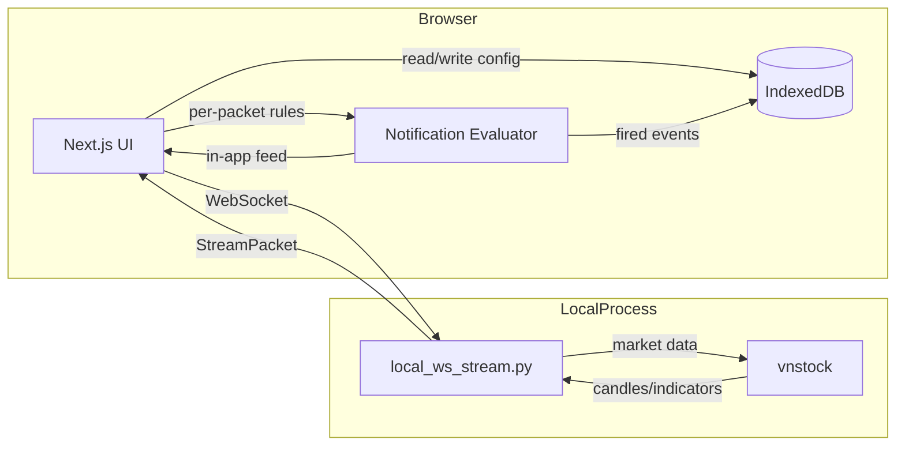

# Candlestick

Candlestick is a browser-only market analytics dashboard that streams indicator snapshots over a local WebSocket to a Next.js frontend. All user data (dashboards, custom indicators, notification rules, and notification history) is stored locally in the browser via IndexedDB — there is no cloud backend or server-side persistence.

It combines:

- A local Python WebSocket stream backed by `vnstock` for live market data and indicator computation
- Browser-local IndexedDB storage for all user configuration and history
- Client-side notification evaluation on every stream packet
- A responsive Next.js dashboard with chart and metrics table views

## Table of Contents

- [Architecture](#architecture)
- [Data Flow](#data-flow)
- [Local-Only Architecture](#local-only-architecture)
- [Repository Structure](#repository-structure)
- [Features](#features)
- [Implemented UI Coverage](#implemented-ui-coverage)
- [Prerequisites](#prerequisites)
- [Quick Start (Local Frontend + Stream)](#quick-start-local-frontend--stream)
- [Indicator Tests](#indicator-tests)
- [Configuration](#configuration)
- [Real Data Source Integration](#real-data-source-integration)
- [Stream Payload Contract](#stream-payload-contract)
- [Indicator Contracts](#indicator-contracts)
- [Troubleshooting](#troubleshooting)
- [License](#license)

## Architecture

Candlestick uses a hydrate-then-stream pattern with no cloud dependencies:

1. A local Python WebSocket server (`scripts/local_ws_stream.py`) fetches market data via `vnstock` and computes indicators.
2. The browser connects to the local stream and validates incoming packets.
3. User configuration (dashboards, indicators, notification rules) is read from and written to IndexedDB on the client.
4. On every packet, the client evaluates notification rules and appends fired events to IndexedDB + the in-app feed.

## Data Flow



## Repository Structure

```text
frontend/
   scripts/
      local_ws_stream.py          # Local WebSocket stream (vnstock + indicators)
      indicators.py               # MTF, LS-DVP, MR-ZSB, ATRM calculations
      requirements.txt            # Runtime deps (numpy, pandas, vnstock, websockets)
      requirements-dev.txt       # + pytest for indicator tests
   src/app/                      # Next.js App Router pages/layout
   src/hooks/
      useWebSocket.ts            # WebSocket lifecycle + packet validation
      useNotificationEvaluator.ts# Client-side rule evaluation on packets
   src/lib/
      types.ts                   # Shared frontend stream + entity types
      client/
         db.ts                  # IndexedDB open + helpers
         persistence.ts         # Dashboards/indicators/notifications CRUD
         user.ts                # Stable local user id
         notifications.ts       # Pure condition evaluation
   src/components/               # Chart + metrics table components
```

## Features

- Fully browser-local: no AWS, no server-side database, no cloud credentials
- IndexedDB persistence for dashboards, custom indicators, notification rules, and event history
- Local Python `vnstock` stream for live data without any deployment
- Client-side notification evaluation with cooldown and in-app event feed
- Frontend connection state model: connecting, connected, reconnecting
- Chart and metrics table optimized for desktop and mobile layouts

## Implemented UI Coverage

- Multi-dashboard selector with add and edit flows in the header.
- Active indicator badge for the selected dashboard.
- Indicator management flow for built-in indicators, custom indicator drafts, parameter editing, and assignment back to a dashboard.
- Notification rule management with validation, in-app event feed, and optional browser push delivery when VAPID configuration is present.
- Dashboard table and chart interaction where selecting a row focuses the detail chart and timerange changes only affect the chart window.
- Stream packet validation before React state updates, including optional notification events.

## Prerequisites

- Node.js 18+
- npm 9+
- Python 3.11+
- pip

No cloud accounts or AWS credentials are required; everything runs locally.

## Quick Start (Local Frontend + Stream)

Install dependencies and start both the Next.js app and the local vnstock stream:

```bash
cd frontend
npm install
npm run mock:ws:install   # pip install -r scripts/requirements-dev.txt
npm run dev:local
```

This starts:

- Next.js app on [http://localhost:3000](http://localhost:3000)
- Local vnstock stream server on [ws://localhost:8788](ws://localhost:8788)

You can also run each process separately:

```bash
cd frontend
npm run mock:ws
```

```bash
cd frontend
npm run dev
```

## Indicator Tests

The indicator calculations live in `frontend/scripts/indicators.py` and are exercised with pytest:

```bash
cd frontend/scripts
python -m pip install -r requirements-dev.txt
python -m pytest
```

Recommended (especially on Windows) to avoid interpreter/PATH mismatches:

```powershell
cd frontend/scripts
python -m venv .venv
.\.venv\Scripts\Activate.ps1
python -m pip install -r requirements-dev.txt
python -m pytest
```

Covered behaviors include output contract enforcement and core indicator edge cases.

## Local-Only Architecture

Candlestick no longer uses any cloud backend. There is no AWS SAM stack, no DynamoDB, and no Lambda polling. All user data is stored in the browser via IndexedDB, and the live stream is served by a local Python process (`frontend/scripts/local_ws_stream.py`) backed by `vnstock`.

## Configuration

### Frontend environment variables

- NEXT_PUBLIC_WEBSOCKET_URL (default: ws://localhost:8788)
- NEXT_PUBLIC_DASHBOARD_ID (default: none; dashboard selected at runtime)

### Local vnstock stream environment variables

These are read by `frontend/scripts/local_ws_stream.py`:

- LOCAL_VNSTOCK_WS_HOST (default: 0.0.0.0)
- LOCAL_VNSTOCK_WS_PORT (default: 8788)
- LOCAL_VNSTOCK_WS_INTERVAL_SECONDS (default: 10)
- LOCAL_VNSTOCK_DASHBOARD_SYMBOLS_JSON (optional dashboard-to-symbol map JSON)
- STOCK_DATA_SOURCE (default: VCI)
- VNSTOCK_API_KEY (optional; passed to `vnstock` when set)
- PRICE_HISTORY_SIZE (default: 100, minimum: 30)
- POLL_INTERVAL_SECONDS (default: 10)

### Frontend optional environment variables

- SYMBOLS_API_URL (optional; server-side URL consumed by `/api/symbols` for live symbol catalog)
- SYMBOLS_API_AUTH_HEADER (optional header name when provider requires auth)
- SYMBOLS_API_AUTH_TOKEN (optional header value when provider requires auth)
- SYMBOLS_API_TIMEOUT_MS (optional request timeout in milliseconds, default: 5000)
- SYMBOLS_CACHE_TTL_SECONDS (optional symbol cache TTL for `/api/symbols`, default: 3600)
- VNSTOCK_SYMBOLS_TIMEOUT_MS (optional timeout for built-in VNStock symbol discovery, default: 45000)
- VNSTOCK_PYTHON_BIN (optional Python executable path for built-in VNStock symbol discovery)

## Real Data Source Integration

The local stream (`frontend/scripts/local_ws_stream.py`) is integrated with a real stock data provider via `vnstock`:

- The script initializes `Vnstock()` (optionally registering `VNSTOCK_API_KEY`).
- For each active dashboard symbol, it fetches daily candles using:
   - `stock_engine.stock(symbol=<SYMBOL>, source=STOCK_DATA_SOURCE)`
   - `.trading.history(period="1D", size=PRICE_HISTORY_SIZE)`
- Indicator outputs are computed from these fetched candles and streamed to WebSocket clients.

Notes:

- `npm run dev:local` runs the local stream directly; there is no separate production polling service.
- Symbol values are normalized to uppercase before provider requests.
- Browser push notifications are configured in-app; the client stores push subscriptions in IndexedDB but delivery requires a push server (out of scope for the local-only setup).

## Symbol Catalog Integration

Dashboard symbol selection now uses a searchable symbol catalog instead of comma-separated input.

- The frontend resolves symbol options through `GET /api/symbols`.
- The route first tries a configured provider (`SYMBOLS_API_URL`) when available.
- If no provider is configured (or provider fetch fails), the route derives symbols from VNStock using the official Unified UI reference path (`Reference().equity.list()`) and normalizes the output for the modal selector.
- The route normalizes provider payloads to a stable shape: `symbol`, `companyName`, optional `exchange`.
- If both provider and VNStock discovery are unavailable, the route returns an empty catalog; the frontend relies on the live API and dashboard symbols for selection.

### Stream symbol key contract

The live WebSocket `data` map is keyed by the canonical (uppercase) dashboard symbol.

- The frontend keys each watchlist row, history series, and selection on the **`data` map key**, not the inner `row.symbol` field. The inner `symbol` value may arrive in a different case from the data provider, so relying on it for scoping caused an empty watchlist.
- Keep `row.symbol` and the `data` map key in agreement (uppercase) to avoid case-sensitivity mismatches in the Symbols Watchlist table.

### Validate live data end-to-end

1. Start the local stream with `npm run mock:ws` (or `npm run dev:local`).
2. Create a dashboard and add symbols via the UI; the dashboard is stored in IndexedDB.
3. Set `NEXT_PUBLIC_WEBSOCKET_URL` to `ws://localhost:8788` (default).
4. Open the dashboard and confirm changing prices/metrics over successive stream intervals.
5. Configure a notification rule and confirm in-app events appear when the condition fires.

## Stream Payload Contract

The frontend expects packets in this shape:

```json
{
   "dashboard_id": "demo_dashboard",
   "connection_id": "local_ab12cd34",
   "as_of_epoch": 1785195600,
   "data": {
      "VIC": {
         "symbol": "VIC",
         "price": 128.25,
         "mtf_score": 77.2,
         "mtf_signal": "BUY",
         "ls_ratio": 2.14,
         "ls_signal": "SHOCK_ACCUMULATION",
         "z_score": 1.28,
         "z_signal": "NEUTRAL",
         "trend_delta": 15.2,
         "trend_signal": "BULLISH_TREND"
      }
   }
}
```

Notes:

- The stream no longer includes `notifications`. Notification rules are evaluated entirely on the client (see `src/lib/client/notifications.ts` and `src/hooks/useNotificationEvaluator.ts`) and fired events are written to IndexedDB.
- The frontend validates `dashboard_id`, `connection_id`, and ticker snapshots before updating state.

## Indicator Contracts

Indicator functions return the stable contract:

```json
{ "metric": 0.0, "signal": "NEUTRAL" }
```

Supported signal set:

- BUY
- SELL
- NEUTRAL
- SHOCK_ACCUMULATION
- SHOCK_DISTRIBUTION
- BUY_OVERSOLD
- SELL_OVERBOUGHT
- BULLISH_TREND
- BEARISH_TREND

## Troubleshooting

- WebSocket not connecting locally:
  - Confirm the local vnstock stream server is running on [ws://localhost:8788](ws://localhost:8788).
  - If `npm run dev:local` exits with `EADDRINUSE`, another process already uses port `8788`; stop that process or set `LOCAL_VNSTOCK_WS_PORT` to another value and update `NEXT_PUBLIC_WEBSOCKET_URL` accordingly.
  - Ensure NEXT_PUBLIC_WEBSOCKET_URL points to ws:// (or allow auto-conversion from http/https in the hook).
- Empty dashboard rows:
  - Verify the dashboard was created in the UI and persists in IndexedDB (check Application > IndexedDB in DevTools).
- `pytest` is not recognized on Windows:
   - Use `python -m pytest` instead of `pytest ...`.
   - Install test deps with the same interpreter: `python -m pip install -r frontend/scripts/requirements-dev.txt`.
   - If needed, create and activate a virtual environment before installing and running tests.

## License

This project is licensed under the terms in LICENSE.
